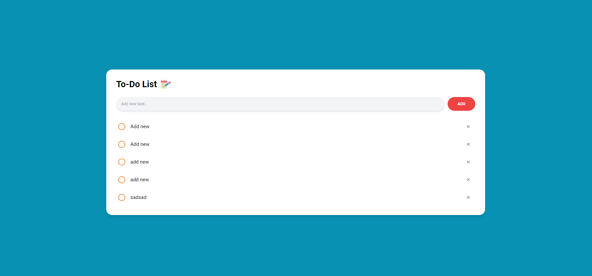

# To-do App Backend
- This is the simple APIs for implementing UIs from the To-do App Frontend. To know how the UIs are written, please check on this github link: [https://github.com/lcht2701/todoapp_fe](https://github.com/lcht2701/todoapp_fe)

# Preview

# Functions
- Add new Task
- View task lists
- Mark Task as "DONE"
- Delete Task

# Techs
- In this simple To-do App, I'm using these technologies:
  - Frontend: ReactJS + Vite, Node.js 20.11.1
  - Backend: ASP.NET Core API (version 6)